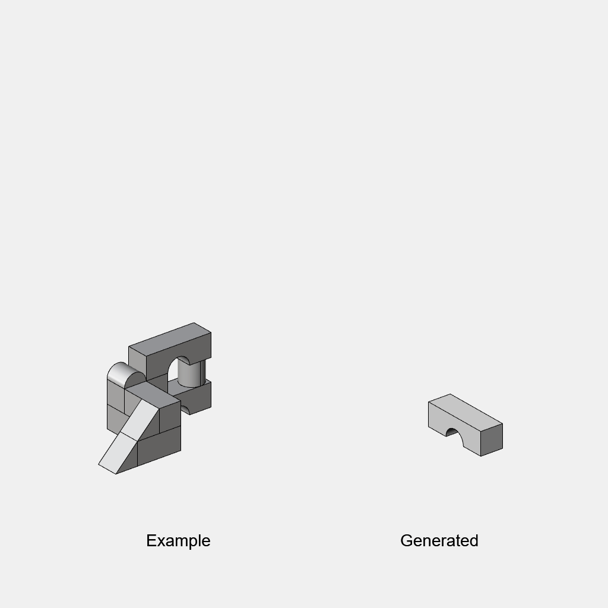
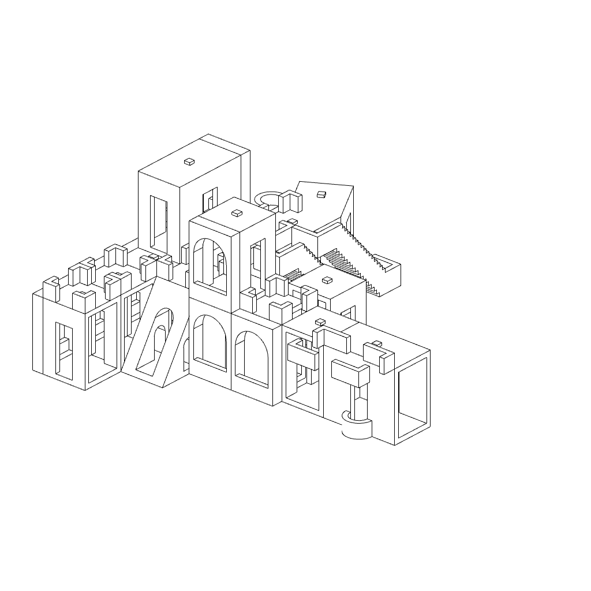

# Blocks

 

Markovian generative 3d modelling for Grasshopper.

### Reading

Provided with an example model that uses [3d instances](https://en.wikipedia.org/wiki/Geometry_instancing), the algorithm will read the *relationsips* ([transforms](https://en.wikipedia.org/wiki/Transformation_matrix)) between adjancent instances.

### Generating

In the generative stage the algorithm will create a *block assembly* that differs from, but retains features, from the example assembly.

To start, the algorithm will choose a block at random from the pool of available blocks. Based on the learned relationships it will choose a canditate block. If the canditate does not collide with the existing geometry it will be added to the generated assembly. Repeat this step as required.

<figcaption>Example assembly and generative stage.</figcaption>

<figcaption>Iterating generative block assemblies.</figcaption>

## Running Blocks on PC

A copy of [Rhino 3d](https://www.rhino3d.com/) is required. A free trial version is available. An [example](https://github.com/AlasdairMott/Blocks/tree/develop/examples) file is provided.

## License

This project is licensed under the GPL v3 License - see the [`LICENSE` file](https://github.com/AlasdairMott/Blocks/blob/develop/.github/LICENSE) for details.